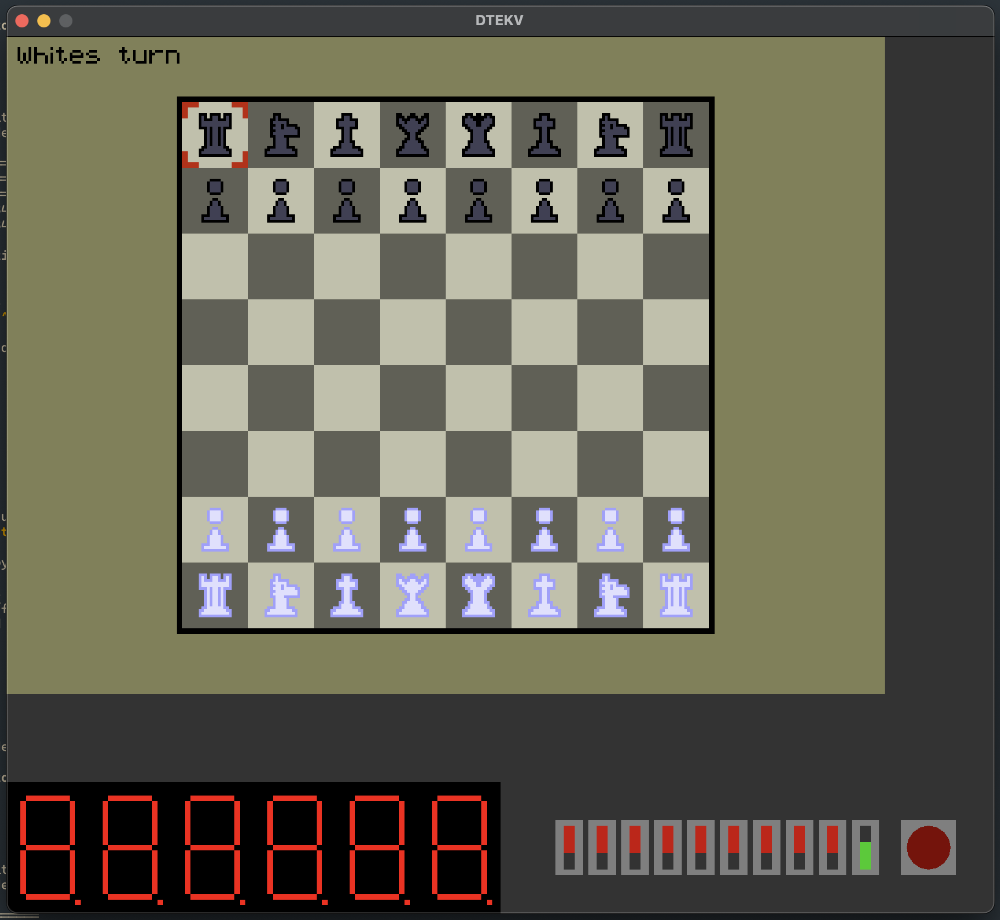

    <h1>DTEK-V emulator</h1>
    
An emulator for the chip that the KTH students taking the IS1500 course have to use

    
<i>A preview of my project running in the emulator</i>

 
 

## Example:

Run `cargo run --examples board_games` to see the emulator in action

## How to use:

Run `dtekv_emulator path/to/bin.bin`, or if you're running directly from this folder: `cargo run --release "path/to/bin.bin"`

This project can take the binary you upload to the dtek-v board and run it in an emulated environment, making it easier to develop your programs without having to upload to the chip every time you want to debug.

## Supported IO devices:

- Button
- Switch
- Timer
- VGA output
- Hex displays
- Button interrupts
- Switch interrupts
- Timer interrupts

## Supported Risc-V instructions:

- [x] LUI
- [x] AUIPC
- [x] JAL
- [x] JALR
- [x] BEQ
- [x] BNE
- [x] BLT
- [x] BGE
- [x] BLTU
- [x] BGEU
- [x] LB
- [x] LH
- [x] LW
- [x] LBU
- [x] LHU
- [x] SB
- [x] SH
- [x] SW
- [x] ADDI
- [x] SLTI
- [x] SLTIU
- [x] XORI
- [x] ORI
- [x] ANDI
- [x] SLLI
- [x] SRLI
- [x] SRAI
- [x] ADD
- [x] SUB
- [x] SLL
- [x] SLT
- [x] SLTU
- [x] XOR
- [x] SRL
- [x] SRA
- [x] OR
- [x] AND
- [x] CSRRW
- [x] CSRRS
- [x] CSRRC
- [ ] CSRRWI
- [x] CSRRSI
- [ ] CSRRCI
- [x] MRET
- [x] ECALL
- [x] MUL
- [x] MULH
- [x] MULHU
- [x] MULHSU
- [X] DIV
- [X] DIVU
- [X] REM
- [X] REMU

## Supported CSR

- mstatus
- mcause
- mepc
- mie
- mpie

## Supported Modes

Only machine mode is supported
